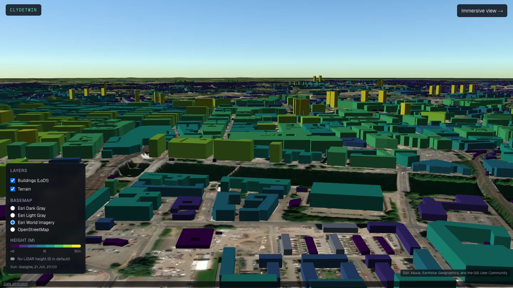
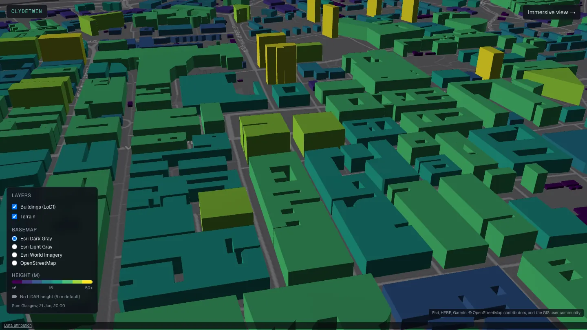
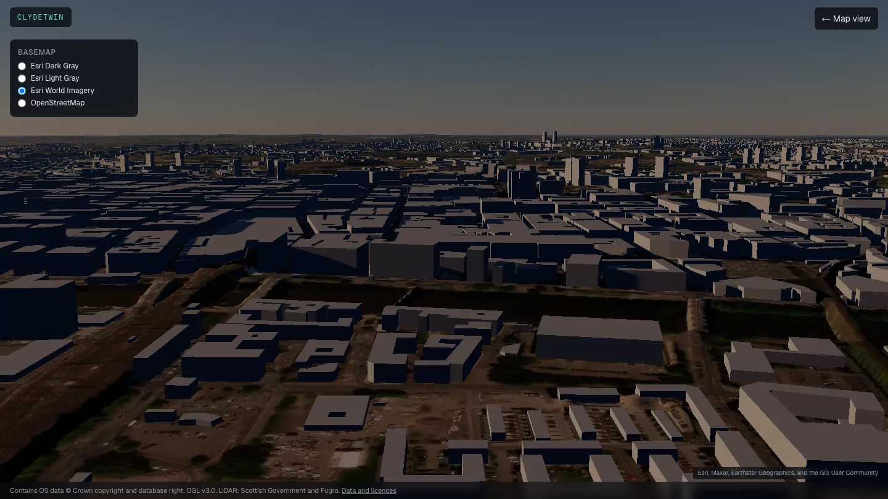
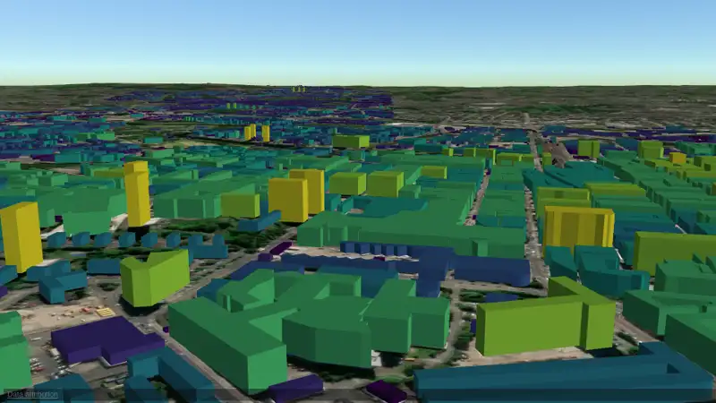
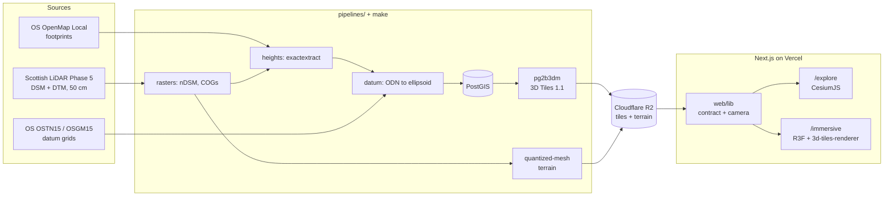

# ClydeTwin

**An open-data 3D digital twin of Glasgow: every building extruded from public LiDAR, in the browser.**

[](LICENSE)
[](https://github.com/fakmalpradana/clydetwin/actions/workflows/ci.yml)
[](CHANGELOG.md)
[](https://clydetwin.vercel.app)
[](DATA_LICENSES.md)

[](https://clydetwin.vercel.app/explore)

| `/explore` (CesiumJS) | `/immersive` (three.js) |
|---|---|
|  |  |

Orbit around the city centre:



**Live demo: <https://clydetwin.vercel.app>** (production goes live after the Phase 1 gate; until then use the preview deployment). Screenshots use an evening sun (`t=2026-06-21T19:00:00Z`) for illustration.

## What is ClydeTwin

ClydeTwin turns public data into a living 3D model of Glasgow. Footprints come from OS OpenMap Local, heights from the
Scottish LiDAR programme (Phase 5, 50 cm), ground from our own terrain built from the same LiDAR, and everything is
published under open licences. Click any building to see its height, where that number comes from and how reliable it
is (a 6 m placeholder is drawn grey, never hidden). The method, the QA numbers and the mistakes found along the way
are written down in [`docs/methods/`](docs/methods/lod1.md) and [`docs/decisions/`](docs/decisions/).

100% open data: no proprietary building or height product feeds anything that is published
(see [`DATA_LICENSES.md`](DATA_LICENSES.md)).

## Features and status

| Phase | Scope | Status |
|---|---|---|
| 1 | LoD1 buildings for all of Glasgow City (81,131), own LiDAR terrain, `/explore`, `/immersive` v0.1, basemap switcher, data/attribution page | ✅ built, release `v0.1.0` pending the gate |
| 2 | Live environment (weather, rivers, rain, air quality), flood zones, API | ⏳ |
| 3 | Moving city: traffic, buses, trains, aircraft, time slider | ⏳ |
| 4 | LoD2 pilot, per-building analytics, thematic styling, flood scenario | ⏳ |
| 5 | `/immersive` v1: data-driven cinematic "Glasgow Now" | ⏳ |
| 6 to 7 | Full-city LoD2, research analytics, v1.0 | ⏳ |

What works today:

- `/explore`: all buildings coloured by height (viridis), click for the attribute panel, layer toggles, camera in the URL
  (`lon, lat, h, hd, p`), real-sun lighting for Glasgow, six switchable basemaps (Esri dark/light gray, Esri imagery,
  OSM, optional Google via the official Map Tiles API).
- `/immersive`: React Three Fiber, same tileset and terrain, physical sky and sun shadows, imagery draped on terrain,
  weak-GPU fallback to `/explore`, two-way switch that keeps the camera.
- `/about/data`: every attribution, licence and the non-operational disclaimer.

## Architecture



Two renderers over one shared contract: [ADR-004](docs/decisions/ADR-004-two-renderers.md). Own terrain instead of ion
World Terrain (which is about 14 m too high here): [ADR-002](docs/decisions/ADR-002-terrain.md).

## Data sources

| Dataset | Publisher | Licence | Update | Used for |
|---|---|---|---|---|
| OS OpenMap Local (`Building`) | Ordnance Survey | OGL v3.0 | OS release cycle | footprints |
| Scottish LiDAR Phase 5 (DSM, DTM) | Scottish Government and Fugro | OGL v3.0 | static (flown 2020-21) | heights, ground, terrain |
| OS Boundary-Line | Ordnance Survey | OGL v3.0 | OS release cycle | city boundary (AOI) |
| OSTN15 / OSGM15 grids | Ordnance Survey (via PROJ) | OS OpenData terms | static | ODN to ellipsoidal heights |
| Esri gray canvases and World Imagery | Esri and partners | Esri terms, attribution shown | continuous | basemaps |
| OpenStreetMap tiles | OpenStreetMap contributors | ODbL 1.0 (kept separate from OGL layers) | continuous | basemap |
| Google Map Tiles (optional) | Google | Google Map Tiles API terms | continuous | basemap, only with a key |

Required attributions and the licensing rules for public tiles are in [`DATA_LICENSES.md`](DATA_LICENSES.md); the
verification of each source is in [`docs/data-verification.md`](docs/data-verification.md).

## Quickstart

Prerequisites: [Docker](https://docs.docker.com/get-docker/) (running), [uv](https://docs.astral.sh/uv/),
Node 22, and the GDAL command line tools (`brew install gdal` or `apt install gdal-bin`).

```sh
cp .env.example .env
make setup                 # uv sync + pre-commit hooks
make lod1                  # MODE=sample: one 1 km tile at George Square, a few minutes, ~100 MB of downloads
make serve-tiles           # tiles at http://localhost:8081/lod1/tileset.json

cd web
echo "NEXT_PUBLIC_TILESET_URL=http://localhost:8081/lod1/tileset.json" > .env.local
npm ci && npm run dev      # http://localhost:3000
```

All of Glasgow City: `make lod1 MODE=aoi` (13.4 GB LiDAR download; afterwards about 8 min for rasters, 70 s for
heights, 3 min for tiles, 90 MB of tiles) and `make terrain MODE=aoi` (own quantized-mesh terrain, about 350 MB), then
`make serve-tiles MODE=aoi PORT=8082` and `make serve-terrain MODE=aoi`, and point `NEXT_PUBLIC_TILESET_URL` /
`NEXT_PUBLIC_TERRAIN_URL` at them. There is no `make dev`: the web app is a plain Next.js project in `web/`.
Optional keys (`NEXT_PUBLIC_CESIUM_ION_TOKEN`, `NEXT_PUBLIC_GOOGLE_MAPS_KEY`) are described in `.env.example`; without
them the app uses flat/own terrain and the free basemaps.

## Repository layout and `make` targets

```
pipelines/   Python data pipeline (aoi, lidar, rasters, footprints, heights, datum, tiles, terrain, publish)
web/         Next.js app: /, /explore, /immersive, /about/data; web/lib is the shared contract
db/          SQL for the build-time PostGIS (extrusion)
docs/        ROADMAP, PROGRESS, phase briefs, methods, ADRs, media
tests/       pytest (datum test vectors, footprints, heights)
collectors/  reserved for the Phase 2 data collectors
```

| Target | What it does |
|---|---|
| `make setup` | `uv sync` and install pre-commit hooks |
| `make lint` / `make test` | ruff / pytest |
| `make db-up` / `make db-down` | local PostGIS (Docker) used to build tiles |
| `make lod1 [MODE=sample\|aoi]` | footprints + LiDAR heights to validated 3D Tiles in `build/$(MODE)/tiles` |
| `make terrain [MODE=...]` | own quantized-mesh terrain from the DTM, with a check |
| `make serve-tiles [MODE=... PORT=...]` | serve tiles over HTTP with CORS |
| `make serve-terrain [MODE=...]` | serve terrain with the gzip header it needs |
| `make publish [MODE=...]` | upload tiles and terrain to Cloudflare R2 under `lod1/v1/` and `terrain/v1/` (`TILE_VERSION`; needs `R2_*` in `.env`) |

Web: `cd web && npm run dev | build | lint | test`.

## Method and validation

Full city, 2026-10-01 ([`docs/methods/lod1.md`](docs/methods/lod1.md)):

- 81,131 footprints selected, 81,131 in the tileset (100%); 0 dropped for missing ground.
- 2.99% of buildings have no usable LiDAR height and get a 6 m default (flagged `height_source = default`).
- LoD1 height is the 70th percentile of the normalised surface model per footprint; median 7.2 m, max 70.1 m.
- Datum conversion (ODN to ellipsoid with OSGM15) matches the 29 official OS test vectors to 2 mm.
- `3d-tiles-validator`: 0 errors, 0 warnings. 389 tiles, 90 MB.
- Own terrain agrees with building ground heights within 0.4 m at five checked buildings; in the viewer, 94% of 186
  buildings spread across the city sit within 2 m of terrain (median 0.3 m).
- Landmarks: four of five tall buildings agree with published heights within 2.3 m (`h_max`).

Known limitation: towers on podiums are drawn at the main-body height until LoD2 (Phase 4).

## Roadmap and changelog

Plan and phase gates: [`docs/ROADMAP.md`](docs/ROADMAP.md) (Indonesian), live status in
[`docs/PROGRESS.md`](docs/PROGRESS.md), release notes in [`CHANGELOG.md`](CHANGELOG.md).

## Contributing

[`CONTRIBUTING.md`](CONTRIBUTING.md): Conventional Commits with a scope, one atomic commit per change, pre-commit
(ruff, gitleaks, 1 MB file limit), tests with `uv run pytest` and `cd web && npm test`. Data, tiles and `.env` never
go into git.

## Citation, licences and attribution

Cite with [`CITATION.cff`](CITATION.cff) (GitHub's "Cite this repository"). Code: AGPL-3.0-or-later. Derived data
(tiles, heights): CC BY-SA 4.0. Documentation: CC BY 4.0. Layers derived from OpenStreetMap are ODbL and kept
separate. Required attributions:

```
Contains OS data © Crown copyright and database right.
Contains public sector information licensed under the Open Government Licence v3.0.
LiDAR: Crown copyright Scottish Government and Fugro (2020).
```

Basemap credits are shown on the map and listed in [`DATA_LICENSES.md`](DATA_LICENSES.md) and `/about/data`.

## Disclaimer and author

ClydeTwin is a research and portfolio project and is **not operational**: heights are estimated from public LiDAR,
not survey grade. Do not use it for navigation, safety, engineering or planning decisions.

Built by **Fairuz Akmal Pradana**, geospatial engineer, MSc Computational Geoscience (University of Glasgow, from
September 2026). [LinkedIn](https://www.linkedin.com/in/fairuz-akmal-pradana-52688b202/) ·
[GitHub](https://github.com/fakmalpradana) · fakmalpradana@gmail.com
