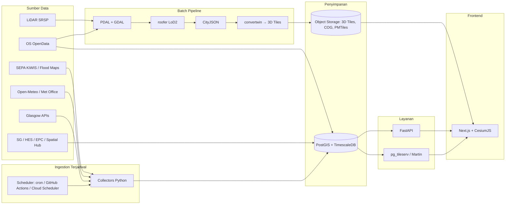
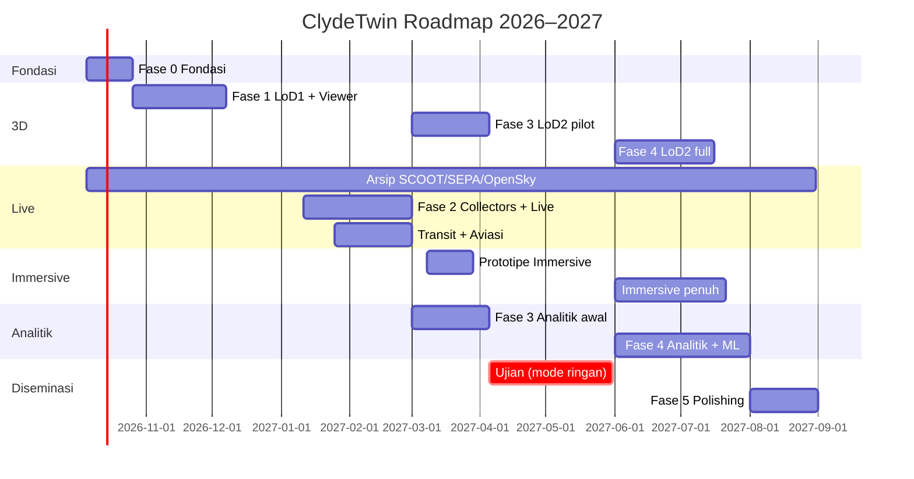

# ClydeTwin — Rencana Platform Digital Twin Kota Glasgow

> Platform digital twin non-komersial berbasis open data untuk Glasgow City.
> Dibangun sebagai portfolio selama MSc Computational Geoscience, University of Glasgow (2026–2027).
> Nama "ClydeTwin" adalah nama kerja. Silakan ganti.

---

## Daftar Isi

1. [Visi, Tujuan, dan Batasan](#1-visi-tujuan-dan-batasan)
2. [Pengguna dan Use Case](#2-pengguna-dan-use-case)
3. [Inventaris Data per Layer](#3-inventaris-data-per-layer)
4. [Kepatuhan Lisensi dan Atribusi](#4-kepatuhan-lisensi-dan-atribusi)
5. [Arsitektur Sistem](#5-arsitektur-sistem)
6. [Pipeline Data (Detail per Modul)](#6-pipeline-data-detail-per-modul)
7. [Data Turunan dan Modul Analitik](#7-data-turunan-dan-modul-analitik)
8. [Desain Dashboard (Frontend)](#8-desain-dashboard-frontend)
9. [Struktur Repository](#9-struktur-repository)
10. [Roadmap dan Timeline](#10-roadmap-dan-timeline)
11. [Infrastruktur, Hosting, dan Biaya](#11-infrastruktur-hosting-dan-biaya)
12. [Quality Assurance dan Validasi](#12-quality-assurance-dan-validasi)
13. [Risiko dan Mitigasi](#13-risiko-dan-mitigasi)
14. [Strategi Portfolio dan Diseminasi](#14-strategi-portfolio-dan-diseminasi)
15. [Checklist Verifikasi Awal (Minggu 1)](#15-checklist-verifikasi-awal-minggu-1)
16. [Lampiran: Daftar Endpoint](#16-lampiran-daftar-endpoint)

---

## 1. Visi, Tujuan, dan Batasan

### 1.1 Visi

Membangun digital twin Glasgow City yang terbuka, dapat direproduksi, dan hidup: model 3D seluruh kota yang terhubung dengan data lingkungan, mobilitas, dan sosial-ekonomi secara near real-time. Seluruh pipeline dibangun dari open data.

### 1.2 Tujuan terukur

| # | Tujuan | Indikator keberhasilan |
|---|---|---|
| T1 | Model 3D bangunan seluruh Glasgow City (~175 km²) | 100% footprint ter-ekstrusi LoD1; LoD2 untuk minimal satu district, lalu seluruh kota |
| T2 | Layer lingkungan live | Cuaca, level sungai, hujan, dan kualitas udara ter-update otomatis (≤ 1 jam) |
| T3 | Layer mobilitas live | Arus SCOOT dan okupansi parkir ter-update (≤ 15 menit) |
| T4 | Analitik per bangunan | Eksposur banjir, rating EPC, potensi surya, dan kebisingan tersedia per bangunan |
| T5 | Reproducibility | Semua pipeline dapat dijalankan ulang dari nol dengan satu perintah (`make all` / Docker Compose) |
| T6 | Portfolio | Repo publik, demo online, 1 blog teknis per fase, 1 paper/poster konferensi |

### 1.3 Batasan (scope)

- **Wilayah:** batas administratif Glasgow City Council, buffer 2 km untuk konteks hidrologi Clyde, **ditambah koridor barat sampai Glasgow Airport (EGPF, Renfrewshire)**. Bandara berada di luar batas Glasgow City, jadi terrain, bangunan, dan data aviasi perlu mencakup koridor ini. Area udara untuk tracking pesawat: kotak ±40 km dari pusat kota.
- **Non-komersial:** tidak ada monetisasi, iklan, atau layanan berbayar. Ini penting karena beberapa sumber (Open-Meteo, data Met Office di AWS) berlisensi non-komersial.
- **Bukan sistem operasional:** tidak untuk keputusan darurat atau peringatan banjir resmi. Wajib ada disclaimer di UI.
- **Data pribadi:** tidak menampilkan alamat individual dari EPC. Agregasi ke level bangunan tanpa alamat, atau ke Data Zone.

---

## 2. Pengguna dan Use Case

| Persona | Kebutuhan | Fitur yang melayani |
|---|---|---|
| Recruiter / dosen penilai | Melihat kemampuan end-to-end dalam 2 menit | Landing page, tur interaktif, video demo |
| Peneliti urban / mahasiswa | Eksplorasi data berlapis dan unduh hasil turunan | Layer toggle, time slider, tombol export |
| Warga yang penasaran | "Apa yang terjadi di kotaku sekarang?" | Panel live: cuaca, sungai, lalu lintas, udara |
| Diri sendiri (riset) | Testbed untuk metode PINN-LSTM banjir di kota kedua | Modul nowcasting sungai Clyde/Kelvin |

**Use case inti:**

1. **UC-01 Jelajah kota 3D:** zoom, orbit, klik bangunan untuk melihat atribut (tinggi, fungsi, heritage, EPC, eksposur banjir).
2. **UC-02 Kondisi kota sekarang:** panel real-time untuk cuaca, level sungai, hujan, NO₂/PM, lalu lintas, parkir.
3. **UC-03 Skenario banjir:** pilih return period (10/200/1000 tahun, plus perubahan iklim), lihat bangunan terdampak.
4. **UC-04 Energi dan net-zero:** warnai bangunan berdasarkan rating EPC dan potensi surya atap.
5. **UC-05 Ketimpangan lingkungan:** bandingkan kebisingan dan polusi dengan SIMD per Data Zone.
6. **UC-06 Nowcast sungai:** prediksi level sungai 1–6 jam ke depan (modul riset).

---

## 3. Inventaris Data per Layer

Status: ✅ terverifikasi aktif | 🔑 butuh akun/key gratis | 🎓 lisensi akademik | ⚠️ perlu dicek

### 3.1 Layer Dasar dan 3D

| ID | Dataset | Sumber | Format | Update | Peruntukan | Status |
|---|---|---|---|---|---|---|
| D01 | LiDAR Phase 1–6 (DSM/DTM 0,5–1 m, LAZ) | Scottish Remote Sensing Portal | GeoTIFF, LAZ, WMS | Statis | Terrain, nDSM, LoD2 | ✅ |
| D02 | National LiDAR 2025–27 (10 pts/m²) | Scottish Remote Sensing Portal | GeoTIFF, LAZ | Bertahap | LoD2 berkualitas tinggi | ✅ ⚠️ cakupan Glasgow |
| D03 | OS OpenMap Local (Buildings) | OS Data Hub | GPKG/SHP | 6 bulanan | Footprint publik (redistribusi aman) | ✅ |
| D04 | OS NGD Buildings (+ 5 atribut tinggi) | OS Data Hub NGD API | GeoJSON | Rutin | Validasi tinggi, fungsi bangunan | 🔑 (kuota £1.000/bln) |
| D05 | OS MasterMap Building Height Attribute | Digimap (EDINA) | CSV/FGDB | Rutin | Validasi LoD1/LoD2 | 🎓 |
| D06 | OS Open Zoomstack | OS Data Hub | Vector tiles/GPKG | Rutin | Basemap 2D | ✅ |

### 3.2 Infrastruktur dan Referensi

| ID | Dataset | Sumber | Peruntukan | Status |
|---|---|---|---|---|
| D07 | OS Open Roads | OS Data Hub | Jaringan jalan, routing, join ke traffic | ✅ |
| D08 | OS Open USRN / Open UPRN / Open TOID / Linked Identifiers | OS Data Hub | Kunci join: jalan ↔ properti ↔ bangunan | ✅ |
| D09 | OS Open Rivers | OS Data Hub | Jaringan sungai (Clyde, Kelvin, Cart) | ✅ |
| D10 | OS Open Greenspace | OS Data Hub | Taman, ruang hijau | ✅ |
| D11 | Code-Point Open | OS Data Hub | Centroid kode pos | ✅ |
| D12 | Spatial Hub Scotland (92 dataset) | Improvement Service | AQMA, cycle network, school catchment, vacant & derelict land, Article 4, dll. | 🔑 akun gratis |
| D13 | Glasgow Open Data Hub (100+ dataset) | Glasgow City Council | Aset dan layanan dewan kota | ✅ |

### 3.3 Lingkungan

| ID | Dataset | Sumber | Resolusi / Frekuensi | Peruntukan | Status |
|---|---|---|---|---|---|
| D14 | UKMO UKV 2 km + Global via Open-Meteo | Open-Meteo | Per jam, horizon 7 hari | Cuaca live + prakiraan | ✅ (non-komersial) |
| D15 | Met Office UKV 2 km (NetCDF, arsip 2 tahun) | AWS Open Data | Grid 2 km | Field cuaca gridded, training model | ✅ ⚠️ cek lisensi terbaru |
| D16 | Met Office DataHub Site Specific | Met Office | 360 call/hari | Prakiraan titik resmi (opsional) | 🔑 |
| D17 | SEPA Time Series (KiWIS) | SEPA | 15 menit | Level sungai, curah hujan | ✅ ⚠️ URL-encode |
| D18 | SEPA Flood Maps v3.0 | SEPA ArcGIS REST | Statis | Luas/kedalaman/kecepatan banjir, skenario iklim 2070 | ✅ |
| D19 | Scottish Air Quality Database | Ricardo/SAQD | Per jam | NO₂, PM10, PM2.5 | ✅ |
| D20 | Noise Mapping Scotland Round 4 | Scottish Government | Grid 10 m, tahunan (2021) | Kebisingan Lden/Lnight | ✅ |

### 3.4 Mobilitas

| ID | Dataset | Sumber | Frekuensi | Peruntukan | Status |
|---|---|---|---|---|---|
| D21 | Traffic API (SCOOT, ~1.000 detektor) | developer.glasgow.gov.uk | ~5 menit | Arus dan kepadatan lalu lintas | 🔑 |
| D22 | Car Park API | developer.glasgow.gov.uk | Real-time | Okupansi parkir | 🔑 |
| D23 | Traffic DATEX II | developer.glasgow.gov.uk | Real-time | Event jalan, VMS | 🔑 |
| D24 | Cycling Counter API | developer.glasgow.gov.uk | Real-time + historis | Sepeda dan pejalan kaki | 🔑 |
| D25 | DfT Road Traffic Statistics (300 titik) | DfT | Tahunan | AADF, tren jangka panjang | ✅ |
| D26 | Traveline National Data Set (TNDS) | Traveline | Mingguan | Rute dan jadwal bus | ✅ |

### 3.4a Transportasi Umum dan Mikromobilitas

| ID | Dataset | Sumber | Frekuensi | Peruntukan | Status |
|---|---|---|---|---|---|
| D32 | BODS Timetables GTFS (mencakup seluruh Great Britain) | DfT Bus Open Data Service | Mingguan | Jadwal, rute, dan halte bus Glasgow dalam GTFS siap pakai | 🔑 akun gratis |
| D33 | NaPTAN | DfT | Rutin | Lokasi semua halte, stasiun rail, dan stasiun Subway | ✅ |
| D34 | Posisi bus live Skotlandia | Transport Scotland / Traveline | — | Belum tersedia sebagai open data (lihat catatan) | ❌ belum ada |
| D35 | Glasgow Subway | NaPTAN (stasiun) + jadwal frekuensi SPT | Statis | Simulasi kereta Subway berbasis headway | ⚠️ tanpa feed live |
| D36 | Darwin Push Port (JSON) | Rail Data Marketplace (National Rail) | Real-time (Kafka) | Kedatangan/keberangkatan aktual, peron, delay | 🔑 gratis |
| D37 | Network Rail TD + Train Movements | Rail Data Marketplace | Real-time (Kafka) | Posisi kereta per signal berth, pergerakan TRUST | 🔑 gratis |
| D38 | Voi e-bike GBFS | Voi (by request) | Real-time | Stasiun dan ketersediaan e-bike | 🔑 ajukan akses |
| D39 | Bike Hire daily counts | developer.glasgow.gov.uk | Harian | Jumlah perjalanan bike hire | 🔑 |
| D40 | Object Count (CCTV) dan Footfall | developer.glasgow.gov.uk | Harian / periodik | Hitungan orang, kendaraan, sepeda; footfall pusat kota | 🔑 |

**Catatan penting:**

- **Bus live di Skotlandia belum terbuka.** Operator Skotlandia tidak wajib publish ke BODS, sehingga posisi live hilang untuk sebagian besar Skotlandia; hanya layanan lintas-batas yang muncul. Regulasi Scottish Bus Open Data sedang disiapkan dengan implementasi bertahap April 2026–April 2028. Rencana: tampilkan bus **terjadwal** (posisi diinterpolasi dari GTFS), lalu upgrade ke live begitu feed resmi keluar. Pantau terus.
- **Bike hire Glasgow sekarang dioperasikan Voi, bukan nextbike.** Voi menggantikan nextbike sejak November 2025, dengan armada seluruhnya e-bike. Skemanya sudah melampaui 282.000 perjalanan dan lebih dari 40 stasiun baru disetujui, awalnya sebagai lokasi virtual geo-fenced. Di negara lain, akses GBFS Voi diminta lewat email ke nap@voiapp.io dengan menyertakan tujuan penggunaan dan persetujuan lisensi Voi. Tanyakan prosedur yang sama untuk Glasgow.
- **Kereta:** feed Darwin Push, Network Rail TD, dan Train Movements tersedia gratis via Kafka di Rail Data Marketplace, tetapi berupa firehose nasional sehingga perlu filter di sisi klien. Glasgow punya jaringan rail suburban terpadat di UK di luar London, jadi layer ini akan sangat hidup.

### 3.4b Aviasi

| ID | Dataset | Sumber | Frekuensi | Peruntukan | Status |
|---|---|---|---|---|---|
| D41 | OpenSky Network REST (`/states/all`) | OpenSky | 5–10 detik (terautentikasi) | Posisi pesawat live, ketinggian, heading, kategori | 🔑 OAuth2 gratis, non-komersial |
| D42 | OpenSky `/states/own` (receiver sendiri) | OpenSky | Real-time | Data dari receiver pribadi, tanpa biaya kredit | 🔑 butuh receiver |
| D43 | adsb.lol API + arsip historis | adsb.lol | Real-time / harian | Cadangan live; arsip ODbL untuk analisis | ✅ |
| D44 | METAR EGPF | Aviation weather service publik | 30 menit | QNH (koreksi ketinggian), angin, visibilitas | ⚠️ pilih sumber |
| D45 | OSM `aeroway` dan `railway` | OpenStreetMap | Rutin | Geometri runway, taxiway, apron, rel, terowongan Subway | ✅ ODbL |

### 3.5 Sosial-Ekonomi, Energi, Heritage

| ID | Dataset | Sumber | Peruntukan | Status |
|---|---|---|---|---|
| D27 | Data Zones 2022 (7.392 zona) dan Intermediate Zones 2022 | Scottish Government | Unit agregasi statistik | ✅ |
| D28 | SIMD 2020v2 | Scottish Government | Indeks deprivasi (berbasis Data Zone 2011) | ✅ ⚠️ beda vintage |
| D29 | EPC Domestik & Non-domestik (s.d. Q1 2026) | data.gov.scot / statistics.gov.scot | Rating energi per properti | ✅ (kolom alamat terbatas) |
| D30 | Listed Buildings, Conservation Areas, Scheduled Monuments | Historic Environment Scotland | Layer heritage | ✅ |
| D31 | Mid-year population estimates per Data Zone | NRS | Kepadatan penduduk | ✅ |

---

## 4. Kepatuhan Lisensi dan Atribusi

Ini bagian yang paling sering diabaikan dalam proyek portfolio, dan justru yang paling dinilai oleh orang industri.

### 4.1 Matriks lisensi

| Kelompok | Lisensi | Boleh redistribusi turunan? | Catatan |
|---|---|---|---|
| OS OpenData, LiDAR Skotlandia, SEPA, HES, SG, Spatial Hub (open) | OGL v3 | Ya | Wajib atribusi |
| OS NGD (Premium API) | Premium Plan T&C | **Terbatas** | Jangan publikasikan ulang geometri/atribut NGD dalam bentuk mentah atau tiles publik. Gunakan untuk validasi internal. |
| Digimap (MasterMap, BHA) | Lisensi akademik EDINA | **Tidak** untuk publik | Hanya untuk riset/validasi. Jangan masuk ke tiles publik. |
| Open-Meteo | CC BY 4.0, non-komersial gratis | Ya (dengan atribusi) | Sesuai karena proyek non-komersial |
| Met Office di AWS | Lisensi dataset (cek halaman AWS terbaru) | Periksa | Versi lama berlisensi CC BY-NC-ND. Aman untuk visualisasi, hati-hati untuk distribusi turunan. |
| EPC | OGL untuk kolom non-alamat | Ya (tanpa alamat) | Alamat hanya untuk riset efisiensi energi. Jangan tampilkan. |
| Glasgow City Council APIs | OGL v3 (umumnya) | Ya | Cek T&C API portal |
| OpenSky Network | Terms of use OpenSky | Visualisasi ya; redistribusi massal tidak | Riset dan non-komersial saja |
| adsb.lol, OpenStreetMap | ODbL | Ya, **share-alike** | Database turunan yang dipublikasikan harus ODbL juga. Pisahkan layer OSM dari layer OGL. |
| National Rail / Rail Data Marketplace | Developer T&C RDG | Ya dengan atribusi | Ikuti panduan brand dan atribusi NRE |
| Voi GBFS | Voi licencing agreement | Sesuai perjanjian | Baru bisa dipakai setelah akses disetujui |
| BODS / NaPTAN | OGL v3 | Ya | Wajib atribusi DfT |

### 4.2 Keputusan desain yang lahir dari lisensi

1. **Footprint publik = OS OpenMap Local**, bukan NGD. Model 3D publik direkonstruksi dari OpenMap Local + LiDAR. NGD dan Digimap BHA hanya dipakai sebagai *ground truth* untuk validasi, dan hanya metrik error agregat yang dipublikasikan.
2. **EPC di-join lewat UPRN**, lalu kolom alamat dibuang sebelum masuk database publik.
3. **Halaman `/about/data`** memuat semua atribusi, lisensi, dan tanggal pengambilan data.

### 4.3 Teks atribusi minimal (footer + halaman data)

```
Contains OS data © Crown copyright and database right [tahun].
Contains public sector information licensed under the Open Government Licence v3.0.
LiDAR: Crown copyright Scottish Government, SEPA and Scottish Water (2012); Scottish Government and Fugro; Scottish Government / Bluesky.
© SEPA [tahun]. Contains Historic Environment Scotland data © HES.
Weather data by Open-Meteo.com (CC BY 4.0), source: UK Met Office.
```

---

## 5. Arsitektur Sistem

### 5.1 Gambaran umum



### 5.2 Pilihan teknologi dan alasannya

| Komponen | Pilihan | Alasan |
|---|---|---|
| Viewer 3D | CesiumJS | Standar 3D Tiles, mendukung terrain, time-dynamic, dan EXT_structural_metadata |
| Web app | Next.js (App Router) | SSR untuk landing page (SEO portfolio), routing rapi |
| API | FastAPI (Python) | Satu bahasa dengan pipeline data dan ML |
| Database spasial | PostgreSQL + PostGIS | Standar industri, query spasial kuat |
| Time series | TimescaleDB (extension Postgres) | Hypertables untuk sensor, satu database saja |
| Model kota | CityJSON (+ opsional 3DCityDB) | Semantik terjaga, ringan, mudah dikonversi |
| Tiles 3D | 3D Tiles 1.1 via `convertwin` | Tool sendiri, sekaligus showcase repo open-source |
| Tiles 2D | PMTiles (vector) + COG (raster) | Serverless, murah di-host di object storage |
| Vector tile server | Martin atau pg_tileserv | Tiles langsung dari PostGIS untuk layer dinamis |
| Orkestrasi pipeline | Makefile + Docker Compose, lalu Prefect (opsional) | Reproducible; Prefect bila pipeline mulai kompleks |
| Scheduler ingest | GitHub Actions cron (tahap awal) → Cloud Scheduler/Cloud Run | Gratis di awal, naik kelas bila perlu |
| ML | PyTorch | Untuk modul nowcast sungai (PINN-LSTM) |
| Viewer immersive | Three.js + React Three Fiber + `3d-tiles-renderer` | Kontrol penuh atas shader dan post-processing |
| Atmosfer dan awan | `@takram/three-atmosphere`, `@takram/three-clouds` | Langit fisik dan awan volumetrik geospasial, dirancang untuk 3D Tiles |
| Visualisasi arus | deck.gl (TripsLayer, HexagonLayer) | Animasi jutaan titik untuk halaman `/insights` |
| Rail streaming | Konsumer Kafka (Python) | Darwin dan TD dari Rail Data Marketplace |
| Real-time ke browser | WebSocket / SSE (FastAPI) | Pesawat, kereta, dan sensor tanpa polling dari browser |
| Konten video (opsional) | Cesium for Unreal | Video sinematik dari 3D Tiles yang sama |

### 5.3 Prinsip arsitektur

1. **Pisahkan batch dan live.** Model 3D dibangun offline, di-host statis. Data live masuk ke database dan disajikan lewat API.
2. **Semua data statis sebagai file di object storage** (3D Tiles, COG, PMTiles). Server hanya untuk data dinamis. Ini menekan biaya mendekati nol.
3. **Satu ID bangunan universal.** Setiap bangunan punya `building_id` internal yang memetakan ke UPRN (bila ada) dan TOID. Semua atribut analitik di-join lewat ID ini.
4. **Setiap dataset punya metadata:** sumber, lisensi, tanggal ambil, versi, checksum. Disimpan di tabel `meta.datasets`.

---

## 6. Pipeline Data (Detail per Modul)

### 6.1 Modul A — Terrain dan Elevasi

**Input:** D01, D02 (DTM/DSM GeoTIFF).

**Langkah:**

1. Unduh tile yang beririsan dengan batas Glasgow + buffer 2 km.
2. Mosaik per produk (`gdalbuildvrt`), reproject tetap di EPSG:27700 untuk analisis.
3. Hitung **nDSM = DSM − DTM**.
4. Ekspor DTM sebagai **Cesium quantized-mesh terrain** (misalnya via `cesium-terrain-builder` atau `ctod`) dengan referensi ke ellipsoid WGS84. Perhatikan konversi tinggi ODN → ellipsoid (OSGM15 / OSTN15).
5. Ekspor COG untuk nDSM dan hillshade.

**Output:** `terrain/` (quantized-mesh), `raster/dtm.cog.tif`, `raster/ndsm.cog.tif`, `raster/hillshade.cog.tif`.

**Catatan penting:** konversi datum vertikal (ODN → ellipsoidal) adalah sumber error klasik "bangunan melayang/tenggelam" di Cesium. Tangani sejak awal dan tulis tes-nya.

### 6.2 Modul B — Bangunan LoD1 (seluruh kota, cepat)

**Input:** D03 (OpenMap Local buildings), nDSM dari Modul A.

**Langkah:**

1. Clip footprint ke batas Glasgow.
2. Zonal statistics nDSM per footprint: `h_p50`, `h_p70`, `h_p90`, `h_max`, dan `ground_z` dari DTM (min/median).
3. Tinggi LoD1 = `h_p70` (konvensi yang umum dipakai, misalnya 3DBAG). Simpan juga yang lain.
4. Buat CityJSON LoD1.x.
5. Konversi ke 3D Tiles via `convertwin`, dengan atribut sebagai `EXT_structural_metadata`.

**Output:** `tiles/buildings-lod1/tileset.json` untuk seluruh kota.

**Target:** selesai di Fase 1 agar platform langsung terlihat "penuh".

### 6.3 Modul C — Bangunan LoD2 (bertahap)

**Input:** D01/D02 point cloud LAZ, footprint D03.

**Langkah:**

1. **Pilot area:** City Centre / Merchant City (~2 km²). Densitas tinggi, bangunan beragam, banyak listed buildings.
2. Pre-processing PDAL: filter noise, klasifikasi ground/building bila belum ada, crop per footprint.
3. Rekonstruksi dengan `roofer` → CityJSON LoD1.2 / 1.3 / 2.2.
4. Grid search parameter `roofer` (misalnya `complexity_factor`, `plane_detect_k`, threshold) terhadap ground truth tinggi dari NGD/BHA. Metodologi ini dapat diambil dari proyek LoD2 sebelumnya.
5. Validasi (lihat §12), lalu jalankan skala penuh per tile 1 km × 1 km.
6. Gabung, konversi ke 3D Tiles dengan LOD switching (LoD1 saat jauh, LoD2 saat dekat).

**Pertimbangan komputasi:** point cloud Glasgow bisa ratusan GB. Proses per tile, simpan di SSD eksternal, dan paralelkan dengan `multiprocessing` atau batch di cloud (Cloud Run Jobs / VM preemptible) bila MacBook tidak cukup.

**Output:** `tiles/buildings-lod2/`, `cityjson/lod22/*.city.jsonl`.

### 6.4 Modul D — Referensi, Jaringan, dan Kunci Join

**Input:** D07–D13, D30.

**Langkah:**

1. Muat semua ke PostGIS schema `ref`.
2. Bangun tabel crosswalk: `building_id ↔ TOID ↔ UPRN ↔ USRN` menggunakan OS Linked Identifiers dan spatial join (UPRN point-in-polygon).
3. Tandai bangunan heritage (spatial join ke listed buildings dan conservation areas).
4. Ekspor layer 2D ke PMTiles untuk basemap tematik.

### 6.5 Modul E — Ingestion Lingkungan (live)

| Collector | Sumber | Interval | Tabel tujuan |
|---|---|---|---|
| `weather_collector` | Open-Meteo UKMO (grid titik di Glasgow, misal 3×3) | 1 jam | `ts.weather` |
| `sepa_level_collector` | KiWIS, stasiun dalam bbox Glasgow | 15 menit | `ts.river_level` |
| `sepa_rain_collector` | KiWIS rainfall 15 menit | 15 menit | `ts.rainfall` |
| `aq_collector` | SAQD / openair (situs Glasgow) | 1 jam | `ts.air_quality` |

**Pola setiap collector:**

```python
# Pseudocode
def run():
    raw = fetch(source, since=last_timestamp())
    validate(raw)  # schema + range checks
    store_raw(raw, bucket="raw/")  # arsip mentah, untuk reproducibility
    upsert(transform(raw), table)  # idempotent
    log_run(status, n_rows)  # tabel meta.ingest_runs
```

**Katalog stasiun:** jalankan sekali `getStationList` KiWIS dengan filter bbox Glasgow, simpan ke `ref.sepa_stations`, lalu pilih time series `15m.Cmd` untuk level (SG) dan hujan.

### 6.6 Modul F — Ingestion Mobilitas (live)

| Collector | Sumber | Interval | Tabel tujuan |
|---|---|---|---|
| `scoot_collector` | Glasgow Traffic API | 5 menit | `ts.traffic_flow` |
| `carpark_collector` | Glasgow Car Park API | 5–10 menit | `ts.carpark` |
| `events_collector` | DATEX II | 15 menit | `ts.road_events` |
| `cycle_collector` | Cycling Counter API | 1 jam | `ts.cycle_counts` |
| `dft_loader` | DfT AADF | Tahunan (batch) | `ref.dft_aadf` |
| `tnds_loader` | TNDS → GTFS (konversi) | Mingguan | `ref.gtfs_*` |

**Penting:** tautan data historis traffic Glasgow dilaporkan pernah mati. Mulailah mengarsipkan data SCOOT sendiri **sejak minggu pertama**. Setelah 9–10 bulan, kamu punya dataset lalu lintas unik yang bisa jadi bahan analisis sendiri.

**Volume:** ~1.000 detektor × 288 sampel/hari ≈ 290 ribu baris/hari. Gunakan TimescaleDB compression + continuous aggregates (15 menit, 1 jam, harian).

### 6.7 Modul G — Data Statis Lingkungan dan Sosial

| Dataset | Proses |
|---|---|
| SEPA Flood Maps (D18) | Unduh per skenario → clip → simpan poligon kedalaman ke PostGIS + PMTiles |
| Noise Round 4 (D20) | Unduh raster/kontur → clip → COG + zonal stats per bangunan |
| Data Zones 2022 + SIMD (D27, D28) | Muat. Buat lookup DZ2011 ↔ DZ2022 (areal/penduduk-weighted) dan dokumentasikan keterbatasannya |
| EPC (D29) | Filter Glasgow → join ke UPRN → **buang kolom alamat** → agregasi per bangunan |
| Populasi (D31) | Join ke DZ2022 → densitas |

### 6.8 Modul H — Transportasi Umum dan Mikromobilitas

Prinsip modul ini: **setiap moda punya "tingkat kehidupan" yang jujur.** UI selalu menandai apakah sebuah kendaraan *live*, *terjadwal*, atau *disimulasikan*.

| Moda | Sumber | Tingkat | Cara menampilkan |
|---|---|---|---|
| Bus | BODS GTFS (D32) | Terjadwal | Interpolasi posisi di sepanjang `shapes.txt` berdasarkan `stop_times`; upgrade ke live saat feed Skotlandia terbit |
| Kereta nasional | Darwin + TD (D36, D37) | Live | Posisi diinterpolasi antar stasiun/berth di geometri rel OSM, dikoreksi dengan waktu aktual Darwin |
| Subway | NaPTAN + headway (D35) | Disimulasikan | Dua loop (Inner/Outer Circle) dengan headway jam sibuk/tidak sibuk; ditampilkan dalam mode "x-ray" bawah tanah |
| E-bike | Voi GBFS (D38) | Live (bila akses disetujui) | Stasiun sebagai bar 3D, tinggi = jumlah sepeda tersedia |
| Bike hire, CCTV count, footfall | D39, D40 | Harian | Grafik dan heatmap di panel `/live` |

**Langkah:**

1. **GTFS loader:** unduh BODS GTFS mingguan → filter agency/stop di AOI Glasgow → muat ke `ref.gtfs_*` → validasi dengan `gtfs-validator`.
2. **Scheduled vehicle engine:** fungsi SQL/Python yang, untuk timestamp `t`, mengembalikan posisi semua trip aktif (linear referencing di sepanjang shape). Dipakai untuk bus dan Subway.
3. **Rail stream consumer:** konsumer Kafka untuk Darwin dan TD → filter TIPLOC/berth area Glasgow (sekitar 1–2% dari firehose) → `ts.rail_events`. Bangun tabel `ref.td_berth_locations` secara bertahap (pemetaan berth → titik di rel), dimulai dari koridor utama (Glasgow Central, Queen Street, Argyle Line, North Clyde Line).
4. **Subway simulator:** geometri terowongan dari OSM `railway=subway`, 15 stasiun dari NaPTAN, headway per periode waktu. Jujur di UI: "Simulated from published frequency".
5. **GBFS collector:** poll `station_status` tiap 1 menit → `ts.bike_station_status`. Dari selisih ketersediaan antar-snapshot, turunkan estimasi aliran perjalanan antarstasiun.
6. **Voi access request (Minggu 1):** email ke Voi dengan tujuan penggunaan (proyek akademik non-komersial).

**Output analitik baru:**

- X11 — Keandalan jadwal kereta (delay per jalur dan jam).
- X12 — Coverage transit: jarak berjalan ke halte/stasiun terdekat × frekuensi layanan per Data Zone, lalu dibandingkan dengan SIMD.
- X13 — Pola permintaan e-bike per stasiun dan korelasinya dengan cuaca.

### 6.9 Modul I — Aviasi Live

**Input:** D41–D45.

**Langkah:**

1. **Collector OpenSky:** OAuth2 client credentials (token 30 menit, refresh otomatis via TokenManager). Bounding box ±40 km dari pusat kota (< 25 sq°, sehingga hanya 1 kredit per panggilan).
   - Standard user (4.000 kredit/hari): polling ~22 detik, 24 jam.
   - Active feeder (8.000 kredit/hari): polling ~11 detik.
   - Receiver sendiri: `/states/own` tanpa biaya kredit, bisa polling setiap beberapa detik.
2. **Penyimpanan:** `ts.aircraft_positions` (hypertable, retensi 30 hari mentah, agregat harian permanen).
3. **Koreksi ketinggian:** gunakan `geo_altitude` bila tersedia; jika tidak, koreksi `baro_altitude` dengan QNH dari METAR EGPF; `on_ground = true` → clamp ke terrain.
4. **Deteksi movement bandara:** transisi `on_ground` di dalam poligon runway EGPF + tanda vertical rate → event `arrival`/`departure` dengan runway yang dipakai. Ini menggantikan endpoint arrivals OpenSky yang hanya berisi data hari sebelumnya.
5. **Streaming ke frontend:** backend push via WebSocket/SSE. Credential OAuth tidak pernah dikirim ke browser.
6. **Receiver ADS-B pribadi (opsional, direkomendasikan):** RTL-SDR + antena 1090 MHz + Raspberry Pi, feed ke OpenSky dan adsb.lol.

**Output analitik baru:**

- X14 — Jumlah overflight di bawah 3.000 ft per Data Zone per hari, disandingkan dengan peta kebisingan Round 4.
- X15 — Runway in use vs arah angin (UKV/METAR).
- X16 — Statistik harian EGPF: movement per jam, campuran kategori pesawat.

---

## 7. Data Turunan dan Modul Analitik

Bagian inilah yang membedakan platform ini dari sekadar "viewer data". Setiap turunan harus punya metodologi tertulis di `docs/methods/`.

| ID | Turunan | Metode ringkas | Input | Level |
|---|---|---|---|---|
| X1 | Tinggi dan volume bangunan | Zonal stats nDSM / LoD2 | Modul A, B, C | Bangunan |
| X2 | Tinggi dan tutupan kanopi pohon | nDSM − mask bangunan, threshold > 2,5 m | Modul A, D03 | Raster 1 m, Data Zone |
| X3 | Eksposur banjir per bangunan | Overlay poligon kedalaman SEPA × footprint → kedalaman maksimum per return period | D18, Modul B | Bangunan, Data Zone |
| X4 | Potensi surya atap | Geometri atap LoD2 (orientasi, kemiringan, luas) × radiasi UKMO; shading dari DSM | Modul C, D14/D15 | Bidang atap |
| X5 | Profil energi bangunan | Rating EPC + estimasi luas lantai dari tinggi LoD / tinggi lantai | D29, X1 | Bangunan, Data Zone |
| X6 | Eksposur kebisingan | Zonal stats Lden/Lnight per fasad/bangunan | D20, Modul B | Bangunan |
| X7 | Indeks ketimpangan lingkungan | Korelasi kebisingan, NO₂, kanopi, banjir vs SIMD | X2, X3, X6, D19, D28 | Data Zone |
| X8 | Pola lalu lintas | Profil harian/mingguan per detektor, deteksi anomali | D21 | Link jalan |
| X9 | Aksesibilitas transit | Isochrone 15 menit dari GTFS + jaringan pejalan kaki | D26, D07 | Data Zone |
| X10 | Nowcast level sungai | PINN-LSTM: hujan (SEPA + UKV) → level stasiun Clyde/Kelvin | D15, D17 | Stasiun |

**Modul riset X10** menjadi jembatan ke tesis: arsitektur yang sama diuji di kota dengan karakteristik hidrologi berbeda (sungai bertanggul pasang-surut Clyde vs. Jakarta Utara). Ini narasi portfolio yang kuat.

---

## 8. Desain Dashboard (Frontend)

### 8.1 Struktur halaman

| Route | Isi |
|---|---|
| `/` | Landing: hero 3D kota (auto-orbit), 3 angka kunci live, tombol "Explore" |
| `/explore` | **Mode Basic**: viewer analitik (Cesium) + panel layer + panel info |
| `/immersive` | **Mode Immersive**: pengalaman sinematik real-time (Three.js/R3F) |
| `/live` | Dashboard ringkas: kartu cuaca, sungai, udara, lalu lintas, parkir + grafik 24 jam |
| `/scenarios/flood` | Skenario banjir dengan pemilih return period |
| `/insights` | Data story (X7, X8, dst.) dalam format artikel interaktif |
| `/about/data` | Katalog dataset, lisensi, atribusi, tanggal update |
| `/about/methods` | Metodologi setiap turunan |

### 8.2 Layout `/explore`

```
┌─────────────────────────────────────────────────────────────┐
│ Top bar: logo | search (alamat/tempat) | time slider | theme │
├──────────┬──────────────────────────────────────┬───────────┤
│ Layer    │                                      │ Info      │
│ panel    │           Cesium 3D Viewer           │ panel     │
│          │                                      │ (klik     │
│ ▸ 3D     │                                      │ bangunan/ │
│ ▸ Env    │                                      │ sensor)   │
│ ▸ Mobil. │                                      │           │
│ ▸ Social │                                      │           │
├──────────┴──────────────────────────────────────┴───────────┤
│ Bottom strip: live ticker (sungai, hujan, NO₂, lalu lintas) │
└─────────────────────────────────────────────────────────────┘
```

### 8.3 Grup layer

- **3D:** Terrain, Bangunan LoD1/LoD2, Heritage highlight, Kanopi pohon
- **Lingkungan:** Cuaca (grid), Stasiun sungai (warna = status level), Hujan, Kualitas udara, Kebisingan, Zona banjir
- **Mobilitas:** Arus SCOOT (garis berwarna), Parkir (okupansi), Event jalan, Counter sepeda
- **Transportasi umum:** Bus terjadwal, Kereta live, Subway (x-ray), Stasiun e-bike Voi
- **Aviasi:** Pesawat live (model 3D), jejak 30 menit terakhir, papan movement EGPF
- **Sosial/Energi:** SIMD, Densitas penduduk, Rating EPC, Potensi surya

### 8.4 Pola interaksi kunci

- **Thematic styling 3D:** `Cesium3DTileStyle` berbasis atribut metadata (warna bangunan by EPC, kedalaman banjir, tinggi).
- **Time slider:** memutar ulang 24 jam / 7 hari data sensor dari TimescaleDB.
- **Klik bangunan:** kartu atribut + tautan "lihat metodologi".
- **Shareable URL state:** posisi kamera + layer aktif tersimpan di query string (bagus untuk demo portfolio).

### 8.5 Non-fungsional

- First load < 5 detik di koneksi standar (lazy-load layer, tiles dengan LOD yang benar).
- Responsif. Di mobile, tampilkan `/live` sebagai default.
- Aksesibilitas: kontras warna, palet colorblind-safe (viridis/cividis) untuk choropleth.

### 8.6 Dua Mode Visualisasi: Basic dan Immersive

Kedua mode membaca **data yang sama** (3D Tiles, API, WebSocket yang sama). Yang berbeda hanya renderer dan tujuannya.

| Aspek | Basic (`/explore`) | Immersive (`/immersive`) |
|---|---|---|
| Tujuan | Analisis, eksplorasi, query atribut | Pengalaman sinematik "Glasgow saat ini" |
| Renderer | CesiumJS | Three.js + React Three Fiber |
| 3D Tiles | Native Cesium | `3d-tiles-renderer` (NASA-AMMOS) |
| Langit dan cahaya | Atmosfer dan pencahayaan matahari bawaan Cesium | Precomputed Atmospheric Scattering (`@takram/three-atmosphere`) |
| Awan | Tidak ada / billboard sederhana | Awan volumetrik dengan bayangan dan light shafts (`@takram/three-clouds`) |
| Bayangan | Shadow map Cesium (opsional) | Cascaded shadow maps + bayangan awan |
| Material bangunan | Warna tematik (EPC, banjir, tinggi) | Shader fasad prosedural (batu pasir khas Glasgow, grid jendela per lantai) |
| Kendaraan | Ikon/titik + model sederhana | Model glTF beranimasi, instancing, lampu malam |
| Perangkat target | Semua, termasuk mobile | Desktop dengan GPU layak; fallback otomatis ke Basic |
| Layer analitik | Semua | Dikurasi (bukan semua layer) |

**Keputusan arsitektur:**

- **Basic tetap di CesiumJS.** Ini mode kerja utama: stabil, lengkap, mendukung styling berbasis metadata, time-dynamic, dan terrain presisi.
- **Immersive di Three.js/R3F, bukan deck.gl.** deck.gl unggul untuk visualisasi data masif (TripsLayer, agregasi hexagon), tetapi tidak dirancang untuk rendering fotorealistik. Pakai deck.gl secara terpisah di halaman `/insights` untuk animasi arus (misalnya TripsLayer bus/kereta sehari penuh).
- **Game engine hanya untuk konten video.** Cesium for Unreal bisa memuat 3D Tiles yang sama untuk membuat video sinematik portfolio, tetapi pixel streaming ke web terlalu mahal untuk proyek non-komersial.
- **Kenapa takram:** pustaka awannya mendukung shadow map pada objek scene, temporal upscaling, light shafts, dan haze, serta dirancang bersama `3d-tiles-renderer`, `astronomy-engine`, Three.js, dan R3F. Statusnya masih beta, jadi kunci versi dan siapkan fallback.

#### 8.6.1 Realisme yang digerakkan data (fitur unggulan)

Inilah pembeda utama dari demo "kota cantik" biasa: **setiap efek visual terikat ke data nyata.**

| Efek visual | Digerakkan oleh | Implementasi |
|---|---|---|
| Posisi matahari/bulan, siang-malam | Waktu nyata + koordinat Glasgow | Prop `date` pada `Atmosphere`, sinkron dengan time slider |
| Tutupan awan per ketinggian | UKV: `cloud_cover_low/mid/high` (D14) | Map ke `CloudLayer` (maks. 4 layer) dengan `coverage` per layer |
| Pergerakan awan | Angin UKV | Offset texture cuaca per frame |
| Hujan dan permukaan basah | Hujan SEPA 15 menit + presipitasi UKV | Partikel hujan instanced; roughness jalan/atap turun, refleksi naik |
| Kabut / "haar" | Visibilitas METAR/UKV | Haze takram + fog jarak |
| Level Sungai Clyde | Level/tide SEPA (D17) | Water plane bershader, tinggi mengikuti gauge |
| Lampu jendela malam | Fungsi bangunan (OSM tags/heuristik) + jam | Emissive grid jendela; kantor padam setelah jam kerja, residensial menyala |
| Kepadatan lalu lintas | SCOOT (D21) | Partikel lampu kendaraan di jalan OS Open Roads; densitas ∝ flow |
| Bus, kereta, Subway | Modul H | Model glTF instanced; Subway tampil dalam cutaway bawah tanah |
| Pesawat | Modul I | Model glTF per kategori; lampu navigasi dan strobe saat malam |
| Skenario banjir | SEPA Flood Maps (D18) | Water plane animasi naik mengikuti raster kedalaman |

#### 8.6.2 Material dan tampilan bangunan

LoD2 dari LiDAR tidak bertekstur, jadi realisme dibangun dengan shader:

1. **Fasad prosedural:** grid jendela berdasarkan tinggi lantai (~3 m) dan lebar dinding; palet material khas Glasgow (batu pasir merah dan pirang untuk tenement, kaca/beton untuk bangunan modern). Pemilihan palet berdasarkan atribut (usia EPC bila ada, fungsi, status listed).
2. **Atap:** material berdasarkan kemiringan dari LoD2 (atap miring = slate, datar = membran/gravel).
3. **Heritage highlight:** listed buildings dapat material yang lebih detail.
4. **Gaussian splatting untuk landmark (opsional, sangat bernilai portfolio):** capture 2–3 landmark (misalnya gedung utama University of Glasgow atau Kelvingrove) dengan foto/video, latih 3DGS, ekspor ke glTF `KHR_gaussian_splatting`. CesiumJS sudah mendukung ekstensi ini sejak versi 1.139 (Maret 2026), dan LOD hierarkis untuk splat sudah masuk 3D Tiles, CesiumJS, dan Cesium for Unreal. Di mode Basic splat tampil via Cesium; di Immersive gunakan renderer splat untuk Three.js yang setara. Pastikan izin memotret dan hindari menangkap wajah orang.
5. **Google Photorealistic 3D Tiles:** tidak dipakai sebagai basis. Syarat layanannya membatasi, dan hal itu melemahkan narasi "100% open data".

#### 8.6.3 Post-processing (Immersive)

- Tone mapping AgX/ACES, bloom (lampu malam, matahari), SSAO/N8AO, TAA/SMAA.
- Depth of field hanya di mode kamera sinematik.
- Semua efek bisa diatur lewat preset kualitas: **Low / Medium / High / Cinematic**.

#### 8.6.4 Mode kamera (Immersive)

| Mode | Deskripsi |
|---|---|
| Orbit | Bebas mengelilingi kota |
| Drone tour | Jalur kamera yang dikurasi (spline) melewati landmark, dengan narasi teks singkat |
| Street level | Kamera setinggi pejalan kaki dengan collision ke bangunan |
| Follow | Mengikuti satu bus, kereta, atau pesawat tertentu |
| Time-lapse | Memutar 24 jam terakhir dalam 60 detik (siang-malam, awan, lalu lintas) |

#### 8.6.5 Performa dan fallback

- Deteksi tier GPU saat load (misalnya `detect-gpu`); perangkat lemah dan mobile diarahkan ke Basic dengan tombol "coba Immersive".
- Target: ≥ 50 fps di laptop dengan GPU terintegrasi modern pada preset Medium.
- Instancing untuk semua kendaraan; LOD 3D Tiles dengan screen-space error yang disesuaikan per preset.
- Awan volumetrik menggunakan temporal upscaling; matikan di preset Low.
- Pantau dukungan WebGPU: pengembang takram sedang mengerjakannya. Tetap di WebGL2 untuk v1.

#### 8.6.6 Menjaga beban kerja tetap realistis

Dua renderer berarti dua kali pemeliharaan. Mitigasinya:

- Paket bersama `@clydetwin/data` (klien API, tipe, konversi koordinat ECEF/EPSG:27700, logika interpolasi kendaraan) dipakai kedua mode.
- Immersive **tidak** mereplikasi semua layer analitik; fokus pada pengalaman "Glasgow Now".
- State kamera dan waktu bisa dibagikan antarmode lewat URL.

---

## 9. Struktur Repository

Monorepo agar mudah dinilai dan dijalankan:

```
clydetwin/
├── README.md                 # Pitch 1 paragraf, GIF demo, quickstart
├── LICENSE                   # Kode: MIT/Apache-2.0
├── DATA_LICENSES.md          # Atribusi semua dataset
├── Makefile                  # make data | make tiles | make up | make test
├── docker-compose.yml        # postgis+timescale, api, tileserver, web
├── pipelines/
│   ├── terrain/              # Modul A
│   ├── buildings_lod1/       # Modul B
│   ├── buildings_lod2/       # Modul C (roofer configs, grid search)
│   ├── reference/            # Modul D
│   └── static_layers/        # Modul G
├── collectors/               # Modul E & F
│   ├── weather/
│   ├── sepa/
│   ├── air_quality/
│   ├── glasgow_traffic/
│   ├── gtfs/                 # BODS GTFS loader + scheduled vehicle engine
│   ├── rail/                 # Kafka consumer Darwin + TD
│   ├── bikeshare/            # Voi GBFS
│   ├── aviation/             # OpenSky + movement detector EGPF
│   └── common/               # retry, logging, schema validation
├── analytics/                # X1–X9
├── ml/
│   └── river_nowcast/        # X10 (PINN-LSTM)
├── api/                      # FastAPI
├── web/                      # Next.js app
│   ├── packages/data/        # @clydetwin/data: klien API, tipe, koordinat, interpolasi
│   ├── viewers/basic/        # CesiumJS
│   ├── viewers/immersive/    # R3F + 3d-tiles-renderer + takram + shaders
│   └── public/models/        # glTF kendaraan dan pesawat
├── db/
│   ├── migrations/           # schema ref, ts, meta, analytics
│   └── seeds/
├── docs/
│   ├── architecture.md
│   ├── methods/              # satu file per turunan
│   └── decisions/            # ADR (Architecture Decision Records)
└── .github/workflows/        # CI, cron collectors, deploy
```

**Konvensi:**

- Setiap pipeline punya `README.md`, `config.yaml`, dan target `make`.
- ADR untuk setiap keputusan besar (misalnya "Kenapa OpenMap Local, bukan NGD, untuk tiles publik"). Recruiter senior sangat menghargai ini.
- Pre-commit: `ruff`, `black`, `eslint`, `prettier`.

---

## 10. Roadmap dan Timeline

Disusun mengikuti kalender akademik Glasgow (Semester 1: Sep–Des, Semester 2: Jan–Mar, ujian: Apr–Mei, dissertation: Jun–Agu). Beban dibuat ringan saat periode ujian.

### Fase 0 — Fondasi (Oktober 2026, 3 minggu)

| Tugas | Output |
|---|---|
| Jalankan checklist verifikasi (§15) | `docs/data-verification.md` |
| Daftar akun: OS Data Hub, Spatial Hub, Glasgow developer portal, Digimap, OpenSky, Rail Data Marketplace, BODS | API keys di secret manager |
| Kirim permintaan akses GBFS ke Voi | Email terkirim |
| (Opsional) Beli dan pasang receiver ADS-B | Receiver feeding ke OpenSky + adsb.lol |
| Setup monorepo, Docker Compose, PostGIS + TimescaleDB | `make up` berjalan |
| **Mulai arsip SCOOT + SEPA segera** (collector minimal) | Data historis mulai terkumpul |
| Unduh batas Glasgow, OS OpenData | Schema `ref` terisi |

**Milestone M0:** repo publik, collector berjalan terjadwal, database lokal terisi data referensi.

### Fase 1 — Kota 3D Pertama (November–Desember 2026, 6 minggu)

| Tugas | Output |
|---|---|
| Modul A: terrain + nDSM | Quantized-mesh + COG |
| Modul B: LoD1 seluruh kota | 3D Tiles LoD1 |
| Web: viewer Cesium dasar + klik bangunan | `/explore` v0.1 |
| Deploy statis (tiles + web) | URL demo publik |
| Blog #1: "Building a city-scale LoD1 of Glasgow from open LiDAR" | Artikel |

**Milestone M1 (sebelum libur Natal):** demo online Glasgow 3D seluruh kota.

### Fase 2 — Kota yang Hidup (Januari–Februari 2027, 7 minggu)

| Tugas | Output |
|---|---|
| Modul E & F lengkap (semua collector) | Tabel `ts.*` terisi |
| FastAPI endpoint time series + GeoJSON | `/api/v1/...` |
| Halaman `/live` + bottom ticker + time slider | Dashboard live |
| Modul G: flood maps, noise, Data Zones, SIMD | Layer statis |
| Modul H: GTFS bus terjadwal, rail live (Darwin/TD), Subway simulasi, Voi GBFS | Layer transportasi umum |
| Modul I: pesawat live + deteksi movement EGPF | Layer aviasi |
| WebSocket/SSE untuk kendaraan bergerak | Stream real-time ke frontend |
| Blog #2: "Streaming a city: ingesting Glasgow's sensors, trains and aircraft" | Artikel |

**Milestone M2:** platform menampilkan data live, layer lingkungan, transportasi umum, dan pesawat.

### Fase 3 — LoD2 dan Analitik (Maret 2027, 4–5 minggu)

| Tugas | Output |
|---|---|
| Modul C pilot: LoD2 City Centre + grid search + validasi | LoD2 pilot + laporan akurasi |
| X1, X2, X3, X6 | Atribut analitik per bangunan |
| Styling tematik 3D | Mode warna EPC/banjir/kebisingan |
| `/scenarios/flood` | Halaman skenario |
| Prototipe Immersive: R3F + 3d-tiles-renderer + atmosfer + awan statis di City Centre | Spike teknis `/immersive` v0.1 |

**Milestone M3:** LoD2 pilot + 4 turunan analitik live + prototipe Immersive terbukti jalan.

### Fase Ringan — Periode Ujian (April–Mei 2027)

- Hanya pemeliharaan: pastikan collector berjalan, perbaiki bug kritis.
- Opsional: tulis draf abstrak konferensi.

### Fase 4 — Skala Penuh dan Riset (Juni–Juli 2027)

| Tugas | Output |
|---|---|
| LoD2 seluruh kota (batch cloud bila perlu) | 3D Tiles LoD2 full |
| X4 (surya), X5 (energi), X7 (ketimpangan), X8 (lalu lintas), X9 (aksesibilitas) | Modul analitik lengkap |
| X10 nowcast sungai (bisa selaras dengan dissertation/tesis) | Model + evaluasi |
| `/insights` data stories (termasuk deck.gl TripsLayer bus/kereta sehari) | 2–3 cerita interaktif |
| Immersive penuh: awan dari data UKV, hujan, siang-malam, lampu jendela, shader fasad, kendaraan dan pesawat, mode kamera | `/immersive` v1.0 |
| X11–X16 (transit dan aviasi) | Analitik tambahan |

**Milestone M4:** platform lengkap sesuai tujuan T1–T5, dengan dua mode visualisasi.

### Fase 5 — Polishing dan Diseminasi (Agustus 2027)

| Tugas | Output |
|---|---|
| Optimasi performa, audit aksesibilitas | Lighthouse ≥ 90 untuk landing |
| Video demo 2–3 menit, direkam dari mode Immersive (opsional: render Cesium for Unreal) | YouTube/LinkedIn |
| (Opsional) Gaussian splat 2–3 landmark sebagai `KHR_gaussian_splatting` | Layer landmark |
| Paper/poster (misalnya GISRUK, FOSS4G UK, atau ISPRS 3D GeoInfo) | Submission |
| Rilis v1.0 + DOI Zenodo untuk repo | Sitasi resmi |

**Milestone M5:** v1.0 dirilis, dipresentasikan, dan terdokumentasi.

### Ringkasan Gantt



---

## 11. Infrastruktur, Hosting, dan Biaya

### 11.1 Lingkungan

| Lingkungan | Setup |
|---|---|
| Lokal (dev + batch berat) | MacBook + SSD eksternal untuk data mentah (LiDAR, arsip). Docker Compose. |
| Batch cloud (opsional) | Cloud Run Jobs / VM preemptible untuk LoD2 skala kota |
| Produksi | Lihat tabel di bawah |

### 11.2 Opsi hosting hemat (target < £10/bulan)

| Komponen | Opsi | Perkiraan biaya |
|---|---|---|
| Web (Next.js) | Vercel Hobby / Cloudflare Pages | Gratis (non-komersial) |
| 3D Tiles, COG, PMTiles | Cloudflare R2 (tanpa biaya egress) | Gratis s.d. 10 GB, lalu murah |
| Database + API | VM kecil (misalnya GCP e2-small / Hetzner CX22) dengan Docker | ~£4–8/bulan |
| Collectors | GitHub Actions cron (awal) → cron di VM yang sama | Gratis |
| Monitoring | Healthchecks.io + UptimeRobot | Gratis |

Manfaatkan juga kredit cloud untuk mahasiswa (GitHub Student Developer Pack, program kredit riset cloud) bila tersedia.

### 11.3 Estimasi penyimpanan

| Data | Perkiraan |
|---|---|
| LiDAR mentah (LAZ + DTM/DSM) Glasgow + buffer | Puluhan–ratusan GB (lokal/SSD saja, tidak di-host) |
| 3D Tiles LoD1 kota | ~0,5–2 GB |
| 3D Tiles LoD2 kota | ~3–10 GB |
| Terrain quantized-mesh | ~1–3 GB |
| Time series 1 tahun (terkompresi) | ~2–10 GB |

---

## 12. Quality Assurance dan Validasi

### 12.1 Validasi model 3D

| Metrik | Ground truth | Target |
|---|---|---|
| RMSE tinggi LoD1 | OS NGD / Digimap BHA (`relmax`, `relroofbase`) | < 2 m |
| RMSE tinggi atap LoD2 | Point cloud (jarak titik ke mesh) | < 0,5 m |
| Validitas geometri | `val3dity` | ≥ 95% solid valid |
| Kelengkapan | Jumlah footprint vs. bangunan terekonstruksi | ≥ 98% |

Laporan validasi dipublikasikan di `/about/methods` (angka agregat saja, sesuai lisensi).

### 12.2 Kualitas data live

- **Schema validation** (pydantic) di setiap collector.
- **Range checks:** level sungai, suhu, dan konsentrasi di luar rentang fisik ditandai `quality_flag`.
- **Freshness monitor:** alert bila sumber tidak mengirim data > 2× interval.
- **Dashboard internal `/admin/health`:** status setiap collector, jumlah baris per jam.

### 12.3 Testing perangkat lunak

- Unit test transformasi data (pytest), termasuk tes konversi datum vertikal.
- Integration test API dengan database seed.
- E2E ringan (Playwright) untuk alur `/explore` → klik bangunan → info panel.
- CI di setiap PR.

---

## 13. Risiko dan Mitigasi

| # | Risiko | Dampak | Kemungkinan | Mitigasi |
|---|---|---|---|---|
| R1 | Cakupan LiDAR Glasgow tidak lengkap/berbeda tahun | LoD tidak seragam | Sedang | Cek di Minggu 1. Kombinasikan fase; catat tahun akuisisi per bangunan sebagai atribut. |
| R2 | API Glasgow berubah/mati | Layer mobilitas kosong | Sedang | Arsip sendiri sejak awal; UI menampilkan "data terakhir" bila sumber mati. |
| R3 | Pelanggaran lisensi OS Premium/Digimap | Reputasi | Rendah (bila dipatuhi) | Aturan §4.2; review sebelum setiap deploy. |
| R4 | Point cloud terlalu besar untuk laptop | Fase LoD2 molor | Tinggi | Proses per tile; batch cloud; pilot area dulu. |
| R5 | Beban kuliah + tesis | Timeline molor | Tinggi | Milestone kecil; fase ringan saat ujian; prioritas MoSCoW (§13.1). |
| R6 | Datum vertikal salah | Bangunan melayang | Sedang | Tes otomatis dengan titik kontrol yang diketahui. |
| R7 | Biaya hosting naik | Harus mematikan layanan | Rendah | Arsitektur statis-dulu; batasi retensi raw data online. |
| R8 | Data EPC terbuka memunculkan isu privasi | Etika | Rendah | Tanpa alamat; agregasi; hanya rating di level bangunan. |
| R9 | Feed bus live Skotlandia tak kunjung terbit | Bus hanya terjadwal | Sedang | Label jujur "scheduled"; arsitektur siap swap ke SIRI-VM/GTFS-RT |
| R10 | Akses GBFS Voi ditolak | Tanpa e-bike live | Sedang | Pakai API bike hire harian Glasgow; tampilkan lokasi stasiun statis |
| R11 | Pustaka takram (beta) berubah API | Immersive rusak | Sedang | Kunci versi; tulis wrapper tipis; fallback langit/awan sederhana |
| R12 | Immersive terlalu berat di laptop penguji | Kesan buruk | Sedang | Deteksi GPU, preset kualitas, fallback otomatis ke Basic, video demo |
| R13 | Firehose Kafka rail membebani VM kecil | Biaya/stabilitas | Rendah | Filter awal, simpan hanya event area Glasgow, atau pakai snapshot API |
| R14 | Kuota OpenSky habis | Pesawat hilang sementara | Rendah | Hormati header `X-Rate-Limit-Retry-After-Seconds`; fallback ke adsb.lol |

### 13.1 Prioritas MoSCoW

- **Must:** LoD1 seluruh kota, terrain, cuaca + sungai + lalu lintas live, flood maps, halaman data/atribusi.
- **Should:** LoD2 pilot, EPC, kebisingan, SIMD, time slider, X3, pesawat live, kereta live, bus terjadwal, Immersive dasar (atmosfer + awan + siang-malam).
- **Could:** LoD2 seluruh kota, X4 surya, X9 aksesibilitas, data stories, awan/hujan berbasis data, lampu jendela, receiver ADS-B sendiri, Gaussian splat landmark, video Unreal.
- **Won't (v1):** akun pengguna, simulasi banjir hidrodinamika sendiri, aplikasi mobile native.

---

## 14. Strategi Portfolio dan Diseminasi

### 14.1 Artefak yang dihasilkan

| Artefak | Audiens | Kapan |
|---|---|---|
| Repo publik + README dengan GIF | Engineer, recruiter teknis | Sejak M0 |
| Demo URL | Semua | Sejak M1 |
| 4 blog teknis (satu per fase besar) | Komunitas geospasial | M1, M2, M3, M4 |
| Video demo 2–3 menit | Recruiter, LinkedIn | M5 |
| Poster/paper konferensi | Akademik | M5 |
| DOI Zenodo | Sitasi | M5 |
| Kontribusi balik (issue/PR ke `roofer`, dokumentasi `convertwin`) | Komunitas open-source | Berjalan |

### 14.2 Narasi portfolio (satu kalimat)

> "Saya membangun digital twin kota Glasgow sepenuhnya dari open data, mulai dari LiDAR mentah hingga model LoD2 3D Tiles yang terhubung dengan sensor live dan analitik banjir, energi, dan ketimpangan lingkungan, dengan pipeline yang sepenuhnya reproducible."

### 14.3 Peluang kolaborasi di Glasgow

- Diskusikan dengan supervisor atau dosen di School of Geographical & Earth Sciences, mungkin ada irisan dengan riset hidrologi/urban.
- Urban Big Data Centre (UBDC) di University of Glasgow: relevan untuk data mobilitas dan urban.
- Komunitas Open Data Scotland: tempat yang baik untuk berbagi hasil dan mendapat masukan.
- Hubungi tim Open Data Glasgow City Council: tunjukkan platform, minta masukan, dan tanyakan akses data historis traffic.

---

## 15. Checklist Verifikasi Awal (Minggu 1)

Lakukan sebelum menulis pipeline besar:

- [ ] Buka tab Map di Scottish Remote Sensing Portal; catat fase LiDAR mana yang menutupi seluruh Glasgow City, tahun akuisisi, dan resolusi.
- [ ] Unduh 1 tile DSM, DTM, dan LAZ di City Centre; cek CRS (EPSG:27700), datum vertikal, dan klasifikasi point cloud.
- [ ] Buat akun OS Data Hub → Premium Plan → uji 1 request NGD Buildings di bbox kecil; catat biaya per request di dashboard.
- [ ] Baca T&C OS Premium tentang caching dan redistribusi; tulis ringkasannya di ADR-001.
- [ ] Daftar di developer.glasgow.gov.uk; uji Traffic, Car Park, dan Cycling API; catat rate limit.
- [ ] Uji KiWIS `getStationList` dengan bbox Glasgow (URL-encode parameter, misalnya `Quality%20Code`).
- [ ] Uji Open-Meteo endpoint UKMO dengan koordinat Glasgow.
- [ ] Cek halaman lisensi terbaru dataset Met Office UKV di AWS.
- [ ] Buat akun Spatial Hub; unduh 1 dataset (misalnya cycle network) terpotong ke Glasgow.
- [ ] Aktifkan akses Digimap lewat akun universitas.
- [ ] Unduh EPC terbaru; cek jumlah record Glasgow dan kelengkapan UPRN.
- [ ] Email Voi untuk akses GBFS Glasgow (bike hire sudah pindah dari nextbike ke Voi sejak November 2025).
- [ ] Daftar BODS, unduh GTFS, dan pastikan agency/rute Glasgow (First Glasgow, McGill's, Stagecoach) ada di dalamnya.
- [ ] Daftar Rail Data Marketplace; langganan Darwin Push (JSON) dan Network Rail TD; ukur volume pesan per menit.
- [ ] Cek status regulasi Scottish Bus Open Data dan apakah Traveline Scotland sudah membuka feed real-time.
- [ ] Buat API client OpenSky (OAuth2), uji `/states/all` dengan bbox Glasgow, cek header `X-Rate-Limit-Remaining`.
- [ ] Pilih sumber METAR EGPF dan uji endpoint-nya.
- [ ] Spike Immersive: jalankan contoh `3d-tiles-renderer` + `@takram/three-clouds` di MacBook, ukur fps dengan tileset LoD1 Glasgow.

---

## 16. Lampiran: Daftar Endpoint

> Endpoint dicatat saat riset awal (September 2026). Verifikasi ulang saat implementasi.

### Elevasi dan 3D

| Sumber | URL |
|---|---|
| Scottish Remote Sensing Portal | https://remotesensingdata.gov.scot/data#/list |
| SRSP WMS (JNCC) | https://srsp-ows.jncc.gov.uk/ows?service=wms&version=1.3.0&request=GetCapabilities |
| OS Data Hub | https://osdatahub.os.uk/ |
| OS Data Hub Plans (kuota Premium) | https://osdatahub.os.uk/plans |
| OS NGD Building Features docs | https://docs.os.uk/osngd/data-structure/buildings/building-features |
| Digimap | https://digimap.edina.ac.uk/ |

### Kota Glasgow dan Skotlandia

| Sumber | URL |
|---|---|
| Glasgow Open Data Hub | https://data.glasgow.gov.uk/ |
| Glasgow Developer Portal (API) | https://developer.glasgow.gov.uk/ |
| Spatial Hub Scotland | https://data.spatialhub.scot/dataset/ |
| Open Data Scotland (agregator) | https://opendata.scot/ |
| Data Zone 2022 (SHP) | https://maps.gov.scot/ATOM/shapefiles/SG_DataZoneBdry_2022.zip |
| Intermediate Zone 2022 (SHP) | https://maps.gov.scot/ATOM/shapefiles/SG_IntermediateZoneBdry_2022.zip |
| Statistical Units WFS | https://maps.gov.scot/server/services/ScotGov/StatisticalUnits/MapServer/WFSServer? |
| EPC Domestik (s.d. Q1 2026) | https://data.gov.scot/dataset/domestic_energy_performance_certificates___dataset_to_q1_2026 |
| HES Downloads | https://portal.historicenvironment.scot/downloads |
| Noise Round 4 (REST) | https://maps.data.gov.scot/arcgis/rest/services/NoiseMapRound4/MapServer |

### Lingkungan

| Sumber | URL |
|---|---|
| SEPA Time Series API docs | https://timeseriesdoc.sepa.org.uk/ |
| SEPA KiWIS base | https://timeseries.sepa.org.uk/KiWIS/KiWIS?service=kisters&type=queryServices&datasource=0 |
| SEPA Flood Maps REST | https://map.sepa.org.uk/server/rest/services/Open/Flood_Maps/MapServer |
| SEPA Environmental Data | https://www.sepa.org.uk/environment/environmental-data/ |
| Open-Meteo UKMO API | https://open-meteo.com/en/docs/ukmo-api |
| Met Office UKV di AWS | https://aws.amazon.com/marketplace/pp/prodview-oiodcatwsyjwm |
| Met Office Weather DataHub | https://datahub.metoffice.gov.uk/ |
| Scottish Air Quality Data | https://www.scottishairquality.scot/data |

### Mobilitas

| Sumber | URL |
|---|---|
| DfT Road Traffic — Glasgow City | https://roadtraffic.dft.gov.uk/local-authorities/3 |
| UBDC contoh collector traffic Glasgow | https://github.com/urbanbigdatacentre/glasgowtrafficdata |
| BODS (registrasi, GTFS, data catalogue) | https://data.bus-data.dft.gov.uk/ |
| Arsip GTFS BODS (UBDC, Zenodo) | https://zenodo.org/records/14779119 |
| Scottish Bus Open Data (status regulasi) | https://www.transport.gov.scot/publication/bus-open-data-analysis-2025/ |
| Open Rail Data Wiki (National Rail feeds) | https://wiki.openraildata.com/index.php/About_the_National_Rail_Feeds |
| Voi (permintaan akses GBFS) | nap@voiapp.io |

### Aviasi

| Sumber | URL |
|---|---|
| OpenSky REST API docs | https://openskynetwork.github.io/opensky-api/rest.html |
| OpenSky token endpoint | https://auth.opensky-network.org/auth/realms/opensky-network/protocol/openid-connect/token |
| adsb.lol API (source) | https://github.com/adsblol/api |

### Visualisasi

| Pustaka | URL |
|---|---|
| @takram/three-clouds | https://www.npmjs.com/package/@takram/three-clouds |
| @takram/three-atmosphere | https://www.npmjs.com/package/@takram/three-atmosphere |
| three-geospatial (monorepo) | https://github.com/takram-design-engineering/three-geospatial |

---

*Dokumen hidup. Perbarui setiap akhir fase: status milestone, keputusan baru (ADR), dan perubahan sumber data.*
